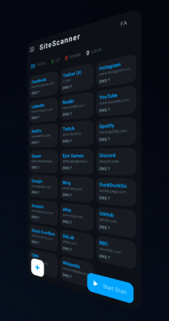
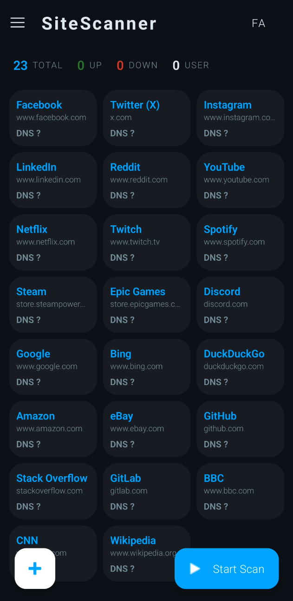
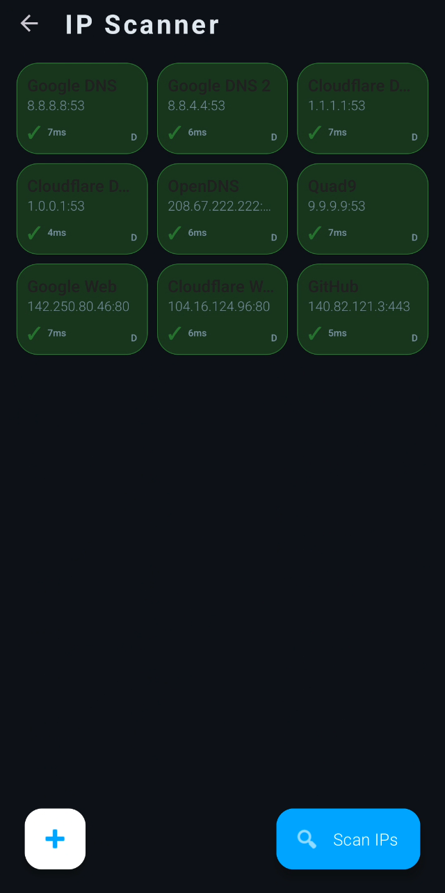
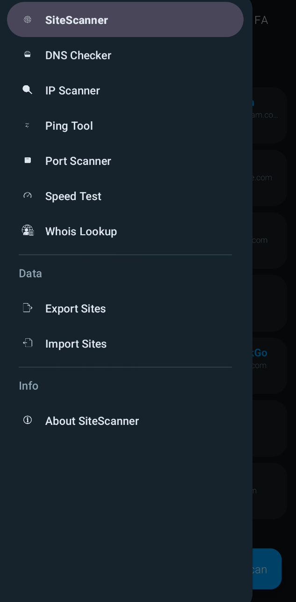

<div align="center">


# SiteScanner

**A fast, bilingual network diagnostic suite for Android**

[](https://android.com)

[⬇ Download APK](#-installation)

---



</div>

---

### What is SiteScanner?

SiteScanner is a Android app that checks whether websites and online services are reachable from your network. It ships with 23 pre-loaded sites and lets you add any custom URL. Beyond site monitoring, it bundles a full set of network diagnostic tools — all in one place, no ads, no tracking, with full **English / Persian (Farsi)** Language support.

---

### ✨ Features

| Tool | What it does |
|------|-------------|
|  **Site Monitor** | Parallel DNS + HTTP check on 23 built-in sites and unlimited custom URLs |
|  **DNS Checker** | Test DNS resolution speed and correctness against multiple servers |
|  **IP Scanner** | Discover active devices on your local network |
|  **Ping Tool** | Send ICMP pings and measure round-trip time in real time |
|  **Port Scanner** | Check which TCP ports are open on any host |
|  **Speed Test** | Measure live download speed with a real-time progress bar |
|  **Whois Lookup** | Retrieve domain registration and ownership information |
|  **Export / Import** | Save your site list to a file and restore it on any device |
|  **Language** | English and Persian (Farsi) with RTL layout |

---

---
### 🖼️ Screenshots

<p align="center">
  
  
  
</p>

---

### 📥 Installation
1. Open [Releases](../../releases/latest) and download `SiteScanner-v1.0.apk`
2. On your Android device go to **Settings → Security → Install unknown apps** and allow your browser or file manager
3. Open the downloaded APK and tap **Install**
---

### 🔧 How It Works

```
Tap "Start Scan"
       │
       ▼
   For each site
   ┌─────────────────────────────────┐
   │ 1. DNS lookup  →  resolve host  │
   │ 2. HTTP/HTTPS  →  check response│
   └─────────────────────────────────┘
       │
       ▼
   Green card = UP ✓   Red card = DOWN ✗
```

- **Filter bar** — tap TOTAL / UP / DOWN / USER to filter the grid
- **Long-press a card** — copies that site's URL to clipboard
- **Long-press a filter stat** — copies all URLs in that group to clipboard
- **Side drawer ☰** — access DNS, IP, Ping, Port, Speed, Whois tools
- **Language button** — toggles EN ↔ FA instantly

---

### 💾 Export & Import

#### Export options
| Option | Format | Content |
|--------|--------|---------|
| All sites | `.json` | Full backup — name, URL, status |
| UP sites | `.txt` | `[Name]URL` per line — re-importable |
| My added sites | `.json` | Only sites you added yourself |
| URLs only | `.txt` | Bare domain list, all sites |
| UP URLs only | `.txt` | Bare domains of reachable sites only |

Tapping any export option opens the **system file browser** — navigate to Downloads, an SD card, Google Drive, or anywhere you like and save.

#### Import

Tap **Import Sites** in the side drawer. The file browser opens — pick any `.txt` or `.json` file.

**Supported import formats:**

*Text format* — one site per line:
```
[Google]www.google.com
[YouTube]www.youtube.com
```

*JSON format* — array of objects:
```json
[
  {"name": "Google",   "url": "www.google.com"},
  {"name": "YouTube",  "url": "www.youtube.com"}
]
```

> Any file exported from this app (JSON or text) can be imported back directly. Duplicate URLs are skipped automatically.

---


### 📋 Permissions Required

| Permission | Reason |
|------------|--------|
| `INTERNET` | All network checks and tools |
| `ACCESS_NETWORK_STATE` | Detect connection type |
| `ACCESS_WIFI_STATE` | IP scanner needs Wi-Fi info |
| `ACCESS_FINE_LOCATION` | Required by Android for Wi-Fi scanning (API 29+) |

---

<div align="center">

Telegram 🔵 [ifa_max](t.me/ifa_max)
</div>

<div align="center">

Made with ❤️ — [IFA Scanner](https://github.com/YOUR_USERNAME/SiteScanner)

</div>
